# B树
## 2-2
- 1970年提出
- 平衡的多路搜索树
- 将二叉搜索树经过适当合并，得到超级节点
  - 每二代合并：4路——3个关键码
  - 每三代合并：8路——7个关键码
  - 。。。
  - 每d代合并：2^d路——2^d-1个关键码
  - 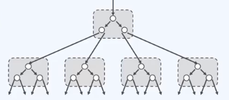
  - 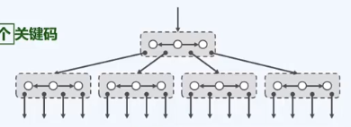
## 2-3
- 多级存储系统中使用B树，可针对外部查找，大大减少I/O次数
- AVL树不行，若有1G的记录，每次查找需要log(2,10^9)=30次I/O操作，且每次只读出一个关键码，得不偿失
- 而B树充分利用外存对**批量访问**的高效支持，将此特点转化为优点；每下降一层，都以**超级节点**为单位，读入**一组**关键码
  - 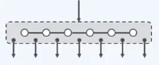
- 多少个关键码一组？
  - 根据磁盘的数据块大小，m=#keys / pg
  - 磁盘数据块大小大概KB，关键码大概4个字节，m=256；1G记录的话，每次查找只需log(256,10^9)<=4次I/O
  - 目前多数数据库系统采用m=200~300
## 2-4 深度统一
- m阶b树，即m路平衡搜索树m>=2
- 外部节点的深度统一相等
- 所有叶节点的深度统一相等
  - 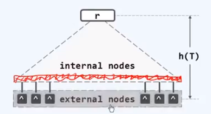
- 树高**h=外部节点的深度**

## 2-5 b树的阶次
- 内部节点各有：（上限）
  - 不超过n(m-1)个关键码
  - 不超过n+1(m)个分支
- 内部节点的分支数n+1也不能太少：（下限）
  - 树根：n+1>=2 （why树根是例外）
  - 其余：n+1>=m/2的上整
- 亦称作(m/2上整, m)-树
  - (4,8)(4,7)(3,6)(3,5)(2,4)
  - (2,4)树与红黑树有关联

## 2-6 紧凑表示
- 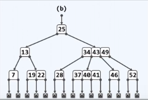
- 省略外部节点后
  - 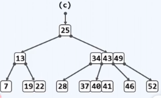

## 2-7 BTNode
- 用线性序列来表示超级节点，用两个向量
  - 一个存放关键码
  - 另一个存放分支引用
    ```cpp
    #define BTNodePosi(T) BTNode<T>*
    template<typename T> struct BTNode {
        BTNodePosi(T) parent;//父节点
        Vector<T> key;//数值向量
        Vector<BTNodePosi(T)> child;//孩子向量（其长度总比key多1）
        BTNode(){parent = NULL; child.insert(0,NULL);}
        BTNode(T e, BTNodePosi(T) lc = NULL, BTNodePost(T) rc = NULL){
            parent = NULL;//作为根结点
            key.insert(0, e);//仅一个关键码
            child.insert(0,lc); child.insert(1, rc);//两个孩子
            if(lc) lc->parent = this; if(rc) rc->parent = this;
        }
    }
    ```

## 2-8 BTree
```cpp
template <typename T> class BTree{
protected:
    int _size; int _order; BTNodePosi(T) _root;
    BTNodePosi(T) _hot;//search后最后访问的非空节点位置
    void solveOverflow(BTNodePosi(T)); //因插入而上溢后的分裂处理
    void solveUnderflow(BTNodePosi(T)); //因删除而下溢后的合并处理
public:
    BTNodePosi(T) search(const T & e); //查找
    bool insert(const T & e);//插入
    bool remove(const T & e);//删除
}

```

## 3-1 查找算法
- 诀窍：只载入必需的节点，尽可能减少I/O操作
- 根节点常驻与内存
1. 根节点中**顺序查找**
2. 根据引用找到下一个节点，载入内存——一次读**I/O操作**
3. 。。。
4. 叶节点，没找到的话，去下一层虚拟外部节点，查找失败
   - 外部引用还有可能指向更低层次存储级别的B树，可以串接起来构成更大的B树
- 失败查找必终止于外部节点

## 4-1 插入算法
- child.insert(r+2, NULL);//与在child最后插入一个NULL等效
- 如发生上溢（分支数超过阶次），需做分裂

## 4-2 分裂
- 设上溢节点中额关键码依次为k0,...,km-1(最大应该为m-1个)
- 取中位数s=m/2下整，以关键码ks为界划分为
  - k0,...,ks-1;ks;ks+1,...,km-1
  - 中位数是中秩的位置
- 关键码ks上升一层，并分裂，以所得的两个节点作为左、右孩子
  - 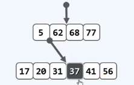
  - 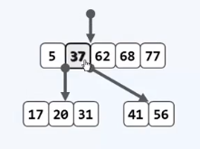
- 由于b树阶次的界限：m/2上整与m，才能让分裂操作解决上溢的问题
  
## 4-3 再分裂
- 若上溢节点的父节点本来已经饱和，则在接纳被提升的关键码之后，也将上溢
- 上溢可能持续发生，并只能是逐层向上传播；最坏情况到根节点

## 4-4 分裂到根
- 根节点上溢过程有所不同
- 上溢的成为的新根节点，唯一一种让树增高的情况
- 这也是为什么树根的分支数下限是例外的
- 每次分裂是O(1)的复杂度，最多分裂h次，所以O(1)*h=O(h)
- 分裂到根节点的概率极低，见习题解析

## 5-1 删除算法
- 确认e存在
- 确定e在节点中的秩r
- 若节点非叶节点，则
  - 在右子树中一直向左，即可
  - 找到e的后继（必属于某叶节点）
  - 并与之交换位置
- 至此，节点必然位于最底层，且其中的第r个关键码就是待删除者
- 如有必要（发生下溢），需做旋转或合并

## 5-2 旋转
- 若节点v下溢，必恰好包含(m/2上整-2)个关键码和(m/2上整-1)个分支
- 先看兄弟节点是否可以借出关键码，但不符合顺序
- 应该向父节点借，兄弟节点再借给父节点
  - 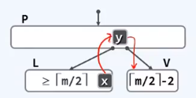
  - 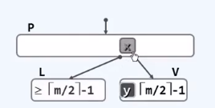
- 若兄弟节点无法借出，见下一节

## 5-3 合并
- 若兄弟节点L\R或者不存在，或者所含关键码均不足m/2上整个
  - 注意，L、R仍必有其一，且恰含(m/2上整-1)个关键码
- 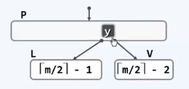
- 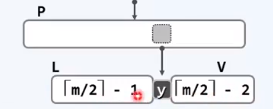
- 父节点若也下溢，则继续如法炮制
  - 可能会使树高降低（唯一降低的可能），下溢到根的概率很低

## B树总结
- 水平的查找对应RAM操作
- 数值的查找对应DISK操作