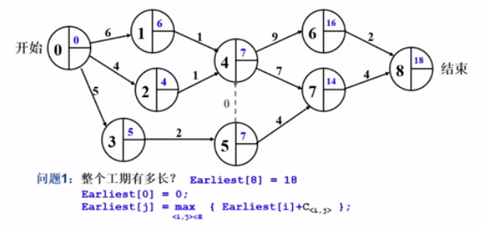
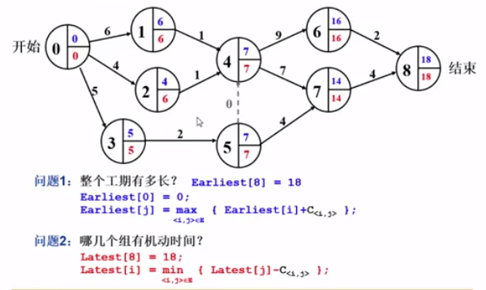
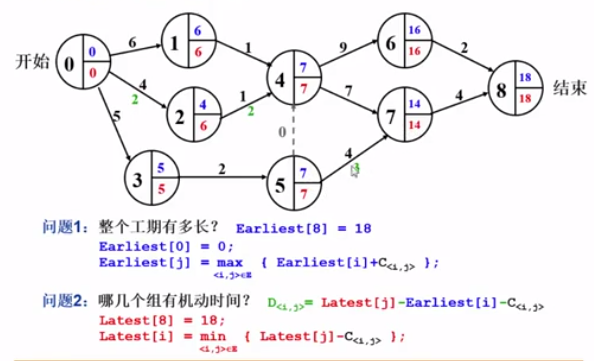
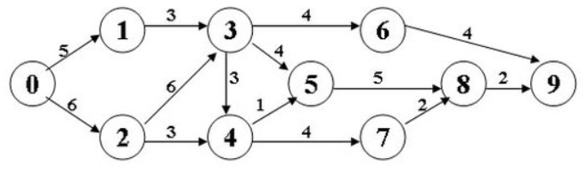
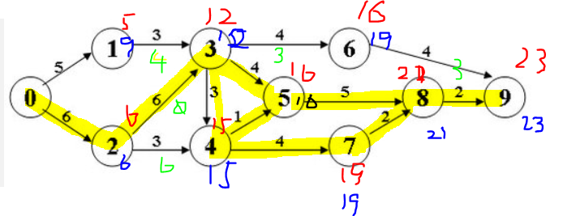

## 图的遍历
### DFS,BFS优缺点
#### BFS
- 优点是可以得到最优解；缺点是在树的层次较深并且子节点个数较多的情况下，消耗内存现象十分严重。因此，BFS适用于节点的子节点个数不多，并且树的层次不太深的情况。
- 对于解决最短或最少问题特别有效，而且寻找深度小，但缺点是内存耗费量大（需要开大量的数组单元用来存储状态）
- 保留全部结点，占用空间大； 无回溯操作(即无入栈、出栈操作)，运行速度快。
- 图的结构比较密集，就是结点之间的关联度比较大时，用BFS要好一点 ，一扫一大片

#### DFS
- 优点是内存消耗小；缺点是难以寻找最优解，仅仅只能寻找有解。
- 对于解决遍历和求所有问题有效，对于问题搜索深度小的时候处理速度迅速，然而在深度很大的情况下效率不高
- 不全部保留结点，占用空间少；有回溯操作(即有入栈、出栈操作)，运行速度慢。
- 图比较稀疏，最好用DFS，命中率和空间利用率较高。、
- 习题链接：
  - https://pintia.cn/problem-sets/434/problems/type/6

## 图的C语言实现
### 邻接矩阵数据结构
1. 最简单的就是定义一个矩阵
```c
int Nv, Ne;
WeightType G[MaxVertexNum][MaMaxVertexNum];//WeightType自己定义，可以是int,double,char等
```
2. 为了便于将其模块化，把上述写在一个结构体里
```c
typedef struct GNode *PtrToGNode;
struct GNode{
    int Nv, Ne;
    WeightType G[MaxVertexNum][MaMaxVertexNum];
    DataType Data[MaxVertexNum];//存储顶点的数据，可能是一个int，甚至是struct
};
typedef PtrToGNode MGraph;//用指针是为了便于往函数中传递该图
```
#### MGraph初始化
```c
MGraph CreateGraph(int VertexNum){
    Vertex V, W;//本质上顶点和VertexNum的整型不是一个意思，区分一下更便于理解
    MGraph Graph;
    Graph = (MGraph)malloc(sizeof(struct GNode));
    Graph->Nv = VertexNum;
    Graph->Ne = 0;

    for(V=0; V<Graph->Nv;++V){
        for(W=0; W<Graph->Nv;++W){
            Graph->G[V][W] = 0;
        }
    }
    return Graph;
}
```
#### MGraph中插入边
```c
typedef struct ENode* PtrToENode;
struct ENode{
    Vertex V1, V2;//<V1,V2>
    WeightType Weight; //网络权重
};
typedef PtrToENode Edge;

void InsertEdge(MGraph Graph, Edge E){
    Graph->G[E->V1][E->V2]=E->Weight;
    Graph->G[E->V2][E->V1]=E->Weight;//无向图
}
```
#### 完整建立一个MGraph
- 输入格式:
  - Nv Ne
  - V1 V2 Weight
  - ...
- 建立图
```c
MGraph BuildGraph(){
    MGraph Graph;
    Edge E;
    Vertex V;
    int Nv,i;

    scanf("%d", &Nv);
    Graph = CreateGraph(Nv);
    scanf("%d", &(Graph->Ne));//省去一个临时变量
    if(Graph->Ne!=0){
        E = (Edge)malloc(sizeof(struct ENode));
        for(i = 0; i<Graph->Ne;++i){
            scanf("%d %d %d", &E->V1, &E->V2, &E->Weight);
            InsertEdge(Graph, E);
        }
    }
    //如果顶点有数据，读入数据
    for(V=0; V<Graph->Nv; ++V)
        scanf("%c", &(Graph->Data[V]));

    return Graph;
}
```
- 简单版本
```c
int G[MAXN][MAXN],Nv,Ne;
void BuildGraph(){
    int v1, v2, w;
    //CreateGraph()
    scanf("%d", &Nv);
    for(int i=0; i<Nv;++i){
        for(int j=0;j<Nv;++j)
            G[i][j]=0;
    }
    scanf("%d",&Ne);
    for(int i=0;i<Ne;++i){
        scanf("%d %d %d", &v1, &v2, &w);
        //InsertEdge()
        G[v1][v2]=w;
        G[v2][v2]=w;
    }
}
```
### 邻接表数据结构
```c
typedef struct AdjVNode *PtrToAdjVNode; 
struct AdjVNode{
    Vertex AdjV;
    WeightType Weight;
    PtrToAdjVNode Next; 
};

typedef struct Vnode{
    PtrToAdjVNode FirstEdge;
    DataType Data;
}AdjList[MaxVertexNum];

typedef struct GNode *PtrToGNode;
struct GNode{
    int Nv,Ne;
    AdjList G;//邻接表
};
typedef PtrToGNode LGraph;
```
#### LGraph初始化
```c
typedef int Vertex;
LGraph CreateGraph(int VertexNum){
    Vertex V, W;//本质上顶点和VertexNum的整型不是一个意思，区分一下更便于理解
    LGraph Graph;
    Graph = (LGraph)malloc(sizeof(struct GNode));
    Graph->Nv = VertexNum;
    Graph->Ne = 0;

    for(V=0; V<Graph->Nv;++V){//仅需一重循环
        Graph->G[V].FirstEdge = NULL;//没有边
    }
    return Graph;
}
```
#### LGraph中插入边
void InsertEdge(LGraph Graph, Edge E){
    PtrToAdjVNode NewNode;

    //为V2建立新的邻接点
    NewNode = (PtrToAdjVNode)malloc(sizeof(struct AdjVNode));
    NewNode->AdjV = E->V2;
    NewNode->Weight = E->Weight;

    //V2插入V1的表头
    NewNode->Next = Graph->G[E->V1].FirstEdge;
    Graph->G[E->V1].FirstEdge = NewNode;

    //对无向图，还要插入<V2，V1>
    NewNode = (PtrToAdjVNode)malloc(sizeof(struct AdjVNode));
    NewNode->AdjV = E->V1;
    NewNode->Weight = E->Weight;

    //V2插入V1的表头
    NewNode->Next = Graph->G[E->V2].FirstEdge;
    Graph->G[E->V2].FirstEdge = NewNode;
}
#### 完整建立一个LGraph
```c
LGraph BuildGraph(){
    LMGraph Graph;
    //下面和前面的MGraph都完全一样
    //这就体现了非简单版本的优势，将功能都抽象成函数，方便之后复用
}
```

## 最短路径问题
- 网络中，求两个不同顶点之间的所有路径中，边的权值之和最小的那一条路径
  - 第一个顶点为源点
  - 最后一个顶点为终点
- 单源最短路径问题：固定源点出发，到所有其他顶点的最短路径
  - 无权图
  - 有权图
- 多源最短路径问题：任意两顶点间的最短路径
### 无权图的单源最短路算法
- 按照递增的顺序找出到各个顶点的最短路——和BFS类似
```c
//伪代码
dist,path都初始化为-1;
dist[源顶点]=0;
void Unweighted( Vertex S ){
    Enqueue(S,Q);
    while(!IsEmpty(Q)){
       V = Dequeue(Q);
       for(V 的每个邻接点 W){
           if(dist[W]==-1){
               dist[W] = dist[V]+1;
               path[W] = V;
               Enqueue(W,Q);
           }
       } 
    }
}
```
- 之后确定路径时,`path[W]=V,path[V]=U,...path[]=S`;然后将点一次压入栈，再弹出，得到正确的顺序
- 时间复杂度：O(2V+E)
  - 每个顶点入队一次，出队一次
  - for循环把每条边被访问一次
### 有权图的单源最短路算法
- 不一定是经过顶点数最少的路径
- 特例：负值圈，不考虑这种情况
- 按照递增的顺序找出到各个顶点的最短路——`Dijkstra`(有权图的最短路径算法)
#### Dijkstra算法
- 令S={源点s+已经确定了最短路径的顶点$v_i$}
- 对任一未收录的顶点v，定义dist[v]为s到v的最短路径长度，但该路径仅经过S中的顶点。即路径$\{s\rightarrow(v_i\in S)\rightarrow v\}$的最小长度
- 若路径是按照递增的顺序生成的，则
  - 真正的最短路必须只经过S中的顶点
  - 每次从未收录的顶点中选一个dist最小的收录（贪心）
  - 增加一个v进入S，可能影响另外一个w的dist值
    - `dist[w]=min{dist[w],dist[v]+<v,w>的权重}`
```c
//Dijkstra算法伪代码
void Dijkstra( Vertex s ){
    初始化源点与邻接点的dist和path;
    源点标记为已访问;
    while(1){
        V = 未收录顶点dist值最小者;
        if(这样的V不存在)
            break;
        collected[V]=true;
        for(V 的每个邻接点 W)
            if(collected[W]==false)
                if(dist[V]+E<V,W> < dist[W]){
                    dist[W] = dist[V] + E<V,W>;
                    path[W]=V;
                }
    }
}//不能解决有负边的情况
```
- 时间复杂度取决于如何实现收录顶点dist值最小者
  - 法1：直接扫描所有未收录顶点-该步的复杂度为O(V)
    - Dijkstra复杂度为$O(V^2+E)$
    - 对于稠密图(E的数量级为$V^2$)效果好
  - 法2：将dist存在最小堆中-该步的复杂度为O(logV)
    - 更新dist[W]的值复杂度为O(logV)
    - Dijkstra复杂度为$O(VlogV+ElogV)=O(ElogV)$
    - 对于稀疏图(E的数量级为V)效果好
### 多源最短路算法
- 法1：直接将单源最短路算法调用V遍
  - 适用于稀疏图$O(V^2logV)$
  - 稠密图$O(V^3+E*V)$
- 法2:Floyd算法
  - $O(V^3)$
#### Floyd算法
- $D^k[i][j]=$路径$\{i\rightarrow\{l<=k\}\rightarrow j\}$的最小长度
- $D^0,D^1,...,D^{V-1}[i][j]$即给出了i到j的真正最短距离
- 最初的$D^{-1}$定义为
  - 对角元为0的带权重的邻接矩阵
  - ij没有直接的边，则D[i][j]定义为正无穷
- 当$D^{k-1}$已经完成，递推到$D^k$时：
  - 或者$k\notin$最短路径$\{i\rightarrow\{l<=k\}\rightarrow j\}$，则$D^k=D^{k-1}$
  - 或者$k\in$最短路径$\{i\rightarrow\{l<=k\}\rightarrow j\}$，则该路径必定由两段最短路径组成：$D^k[i][j]=D^{k-1}[i][k]+D^{k-1}[k][j]$
```c
//Floyd算法伪代码
void Floyd(){
    for(i=0;i<N;++i)
        for(j=0;j<N;++j){
            D[i][j]=G[i][j];
            path[i][j]=-1;
        }
    
    for(k=0;k<N;++k)
        for(i=0;i<N;++i)
            for(j=0;j<N;++j)
                if(D[i][k]+D[k][j]<D[i][j]){
                    D[i][j]=D[i][k]+D[k][j];
                    path[i][j]=k;
                }
}
```
- Floyd可以有负权边是因为它依靠的动态规划，比如a-b权值为1,而a-c权值2,c-b权值为-3，那么根据算法a-b最短路径为-1.
  - Dij算法不能有负权边的原因是它依靠贪心算法，a-b最短路径就为1,实际上是-1
- Floyd 也不能有负值回路
  - 需要进行简单变换就可以使用Floyd算法，可以将负值视为某种不可无限重复的路径
  - 1）检查是否有负值圈（检查权重是否有负值，并找出最小负值）
  - 2）如果有负值圈，对所有非对角元的权重增加最小负值+1（例如最小负值为-10，则所有非对角元的权+11），最小负值变为1.
  - 3）使用Floyd算法
  - 4）最短路径及长度：直接输出矩阵中保存的最短路径，并记录该最短路径经过的边个数n，长度等于矩阵中保存的长度减去最短路径经过的边的个数倍的最小负值+1
### C语言实现
### 习题：旅游规划问题
- 选出最短路径，当路径长度相同时选收费最少的路径
- 权重：距离与收费
- 用Dijkstra给出距离的最短路径，当等距离时按收费更新
```c
//伪代码
void Dijkstra( Vertex s ){
    初始化源点与邻接点的dist和path;
    源点标记为已访问;
    while(1){
        V = 未收录顶点dist值最小者;
        if(这样的V不存在)
            break;
        collected[V]=true;
        for(V 的每个邻接点 W)
            if(collected[W]==false)
                if(dist[V]+E<V,W> < dist[W]){
                    dist[W] = dist[V] + E<V,W>;
                    path[W] = V;
                    cost[W] = cost[V] + C<V,W>;
                }
                else if(dist[V]+E<V,W> == dist[W]
                        && (cost[V]+C<V,W> < cost[W])){
                    cost[W] = cost[V] + C<V,W>;
                    path[W] = V;
                }
    }
}
```
- 其他类似问题
  - 要求数最短路径有多少条
    - count[s]=1;
    - 如果找到更短路:count[W]=count[V];
    - 如果找到等长路:count[W]+=count[V];
  - 要求边数最少的最短路
    - count[s]=0;
    - 如果找到更短路:count[W]=count[V]+1;//和费用类似，费用视为1
    - 如果找到等长路:count[W]=count[V]+1;//和费用类似，费用视为1
- 习题链接：
  - https://pintia.cn/problem-sets/988034414048743424/problems/type/7


## 最小生成树问题
- Minimum Spanning Tree
 - 是一颗树
   - 无回路
   - V个顶点一定有V-1条边
- 是生成树
   - 包含图的全部顶点
   - V-1条边都在图里
   - 生成树不唯一
   - 向生成树中任加一条边都一定构成回路
- 边的权重和最小
+ 最小生成树存在$\iff$图连通
+ 最小生成树可能不唯一
  + 如果图中所有边的权值都不同，只有一种最小生成树
  + 但是如果有2条或以上的边有相同权值，这个最小生成树就不一定唯一了
  + 不过即使不唯一，这个最小的权值和一定唯一的
- 使用贪心算法解决这个问题
  - 贪：每一步都要最好的
  - 好：权重最小的边 
  - 需要约束：
    - 只能用图里有的边
    - 只能用V-1条边
    - 不能有回路
### Prim算法
- **从一颗根结点开始让小树长大**
- 有点像Dijkstra算法
```c
//伪代码
void Prim(){
    MST={s};
    //MST怎么存:parent[s]=-1
    while(1){
        V = 未收录顶点中dist最小者；
        //dist选为到当前这棵最小生成树的距离，初始化应该为E(s,V)或正无穷
        if(这样的V不存在)
            break;
        将V收录进MST:dist[V]=0;
        for(V的每个邻接点W)
            if(dist[W]!=0)//这个顶点不在树里
                if(E(V,W)<dist[W]){//这一步应该只会把原本INF的变为当前边的权值
                    dist[W]=E(V,W);
                    parent[W] = V;
                }
    }
    if(MST中收的顶点不到V个)
        ERROR("生成树不存在");
}
```
- 时间复杂度：
  - 若用最简单的方法实现寻找最小者，则为$O(V^2)$
  - 对稠密图合算
### Kruskal算法
- 若为稀疏图，则用该算法较为合算
- **将森林合并成树**
- 直接了当的贪心，每次把最小的边收进来，然后合并树
```c
//伪代码
void Kruskal(Graph G){
    MST={};
    while(MST中不到V-1条边&&E中还有边){
        从E中取一条权重最小的边E(V,W);//用最小堆实现
        将E(V,W)从E中删除；
        if(E(V,W)不在MST中构成回路)
        //利用并查集，加入前检查V和W是否在同一个集合内，若已经在一个集合内则会构成回路
            将E(V,W)加入MST
        else
            彻底无视E(V,W)
    }
    if(MST中不到V-1条边)
        ERROR("生成树不存在");
}
```
- 时间复杂度：O(ElogE)
- 适用于稀疏图，E的数量级与V相当

## 拓扑排序
- 依赖问题；AOV(Activity On Vertex)网络
- 拓扑序
  - 如果图中从V到W有一条有向路径，则V一定排在W之前。满足此条件的顶点序列称为一个拓扑序
  - 获得拓扑序的过程就是拓扑排序
- AOV如果有合理的拓扑序，则必定是有向无环图(Directed Acyclic Graph, DAG)
- 每次都选择入度为0的顶点输出
### 拓扑排序算法
```c
//伪代码
//方法1
void TopSort(){
    for(cnt=0;cnt<V;++cnt){
        V=未输出的入度为0的顶点;//O(V)
        if(这样的V不存在){
            ERROR("图中有回路");
            break;
        }
        输出V，或记录V的输出序号；
        for(V的每个邻接点W)
            Indegree[W]--;
    }
}
//方法2
//随时将入度变为0的顶点放到一个队列里来减少时间复杂度
//时间复杂度：O(E+V)
void TopSort(){
    for(图中每个顶点V)
        if(Indegree[V]==0)
            Enqueue(V,Q);
    while(!isEmpty(Q)){
        V=Dequeue(Q);
        输出V，或记录V的输出序号；
        ++cnt;
        for(V的每个邻接点W)
            if(--Indegree[W]==0)
                Enqueue(W,Q);
    }
    if(cnt!=V){
        ERROR("图中有回路");
    }
}
```
- 方法2还能用来检测有向图是否为DAG
- 分别用队列和堆栈作为容器，对计算机专业课程进行拓扑排序，得到的序列有什么区别？用哪种容器排课更合理？
  - 队列：拓扑排序后排的课是相互独立的，没有依赖性 ，类似于BFS的层序遍历；单栈：拓扑排序后排的课是相互关联的类似于DFS的深度搜索，会将一门课的相关后续课程全部输出；
  - 对于排课而言队列比较合理，因为**用队列当容器类似广度优先遍历**，每次可以多排几门课。而**用栈做容器则类似深度优先遍历**，每次都把相关的课上到完，比如上了微积分上册，就上微积分下，再上数值分析等等
### 关键路径问题
- AOE(Activity On Edge)网络
  - 一般用于安排项目的工序
- 由绝对不允许延误的活动组成的路径
  - 无机动时间的顶点组成的路径
  - 不止一条
+ 例子:
- 整个工期有多长
  - 
    - $Earliest[0] = 0$
    - $Earliest[j] = \underset{<i,j>\in{E}}{\max}\{Earliest[i]+C_{<i,j>}\}$
  - 可以由拓扑排序改一下来实现
- 哪几个组有机动时间
  - 
    - $Latest[8] =18$
    - $Latest[i] = \underset{<i,j>\in{E}}{\min}\{Latest[j]-C_{<i,j>}\}$
  - 
    - $D_{<i,j>}=Latest[j]-Earliest[i]-C_{<i,j>}$
+ 习题：
  - 
  - 最早工期
    - 
    - 23
  - 如果<0,2>组能加快进度，整个项目就能提前完工
    - 是关键路径，所以正确
