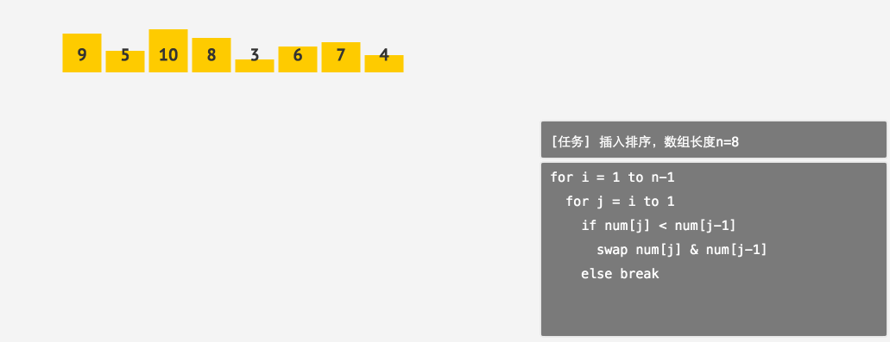
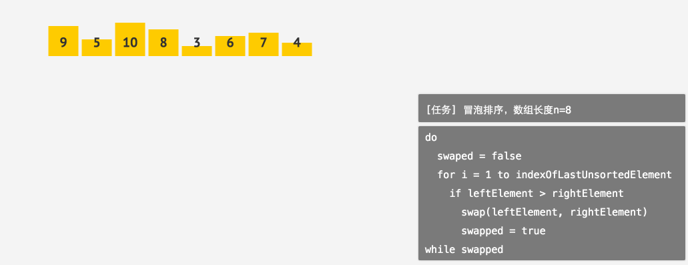
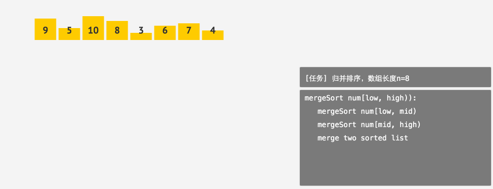
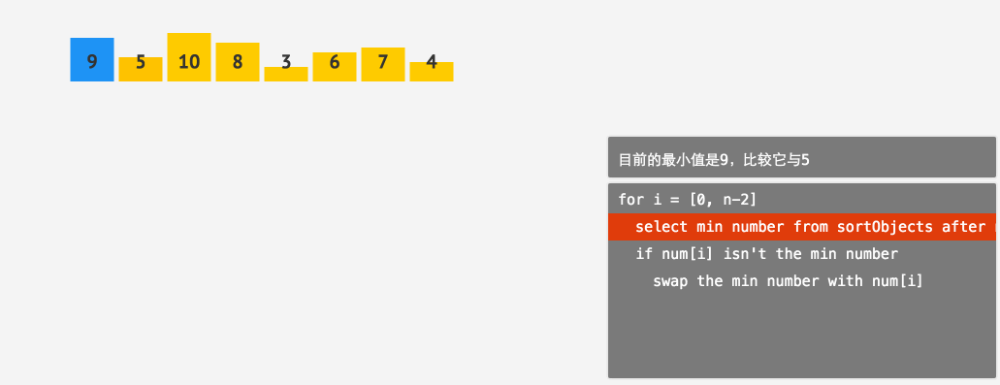
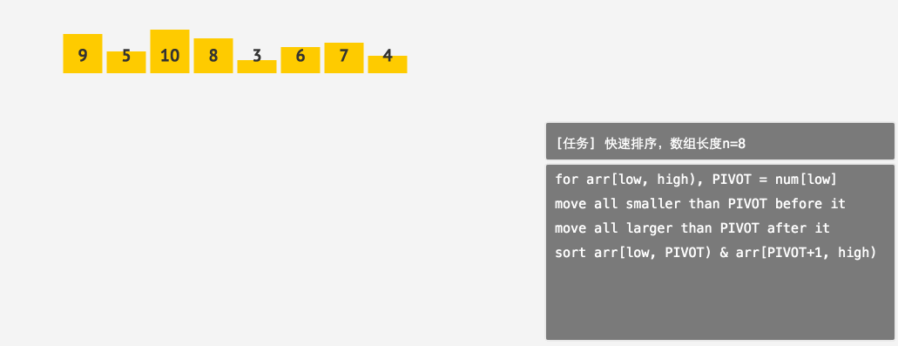

# 排序算法
- 给定一个 nn 个元素的线性表 $(a_0, a_1, ..., a_{n-1})$,排序算法返回这个序列重新排列的结果 $(A_0, A_1, ..., A_{n-1})$,满足 $A_0 \leq A_1 \leq ... \leq A_{n-1}$ 。这里的小于等于号可以替换为其他比较符号。
- 插入排序(insertion sort)、冒泡排序(bubble sort)、归并排序(merge sort)、选择排序(selection sort) 和 快速排序(quick sort)
- 根据算法的时间复杂度,可以将排序算法分为复杂度为 $\mathcal{O}(n\log n)$、$\mathcal{O}(n)$或 $\mathcal{O}(n^2)$ 等时间复杂度的排序算法。比如 $\mathcal{O}(n)$ 的 基数排序(radix sort)、$\mathcal{O}(n\log n)$的归并排序、$\mathcal{O}(n^2)$ 的冒泡排序。
- 根据排序过程中元素是否完全保存在内存中,可以将算法分为 内部排序(internal sort) 和 外部排序(external sort)。本章介绍的这 55 种排序算法都是内部排序算法。
- 对于一个排序算法,如果任意两个元素 $a_i$ 和 $a_j$ 在排序前的线性表中满足条件 $i < j$且 $a_i=a_j$,在排序后$a_i$仍在 $a_j$ 之前,则称这个排序算法为**稳定排序(stable sort)**,否则称这个排序算法为**不稳定排序(unstable sort)**
- 稳定的优点：**排序算法如果是稳定的，那么从一个键上排序，然后再从另一个键上排序，第一个键排序的结果可以为第二个键排序所用**。基数排序就是这样，先按低位排序，逐次按高位排序，低位相同的元素其顺序再高位也相同时是不会改变的。
- 有很多算法都要基于排序算法的结果来进行,比如折半查找算法等。对于现有的排序算法,我们已经可以证明其中几种(堆排序、归并排序)的运行时间上界$\mathcal{O}(n\log n)$ 和比较排序算法(不考虑不用通过比较获得排序结果的希尔排序等)的最坏情况下界是相等的,也就是说,这几种算法已经是渐进最优的比较排序算法。
## 稳定排序
- 插入排序、冒泡排序和归并排序
### 插入排序算法
- 插入排序是一种非常直观的排序算法
- 它的基本思想是将线性表分为已排序的前半部分和待排序的后半部分,从待排序部分选出第一个元素,插入到已排序部分的对应位置中,直到全部记录都插入到已排序部分中。
- 插入排序每次插入的时间复杂度为 $\mathcal{O}(n)$,一共执行 $n-1$ 次,因此总体时间复杂度为 $\mathcal{O}$。
- 在插入时查找插入位置的过程可以使用折半查找算法将查找位置的复杂度优化到 $\mathcal{O}(\log n)$,但因为还需要 $\mathcal{O}(n)$ 的时间复杂度来在顺序表上执行移动操作,所以总体时间复杂度依然是 $\mathcal{O}(n^2)$。

```cpp
//伪代码
//升序
for i = 1 to n-1
    for j = i to 1
        if num[j] < num[j-1]
            swap num[j] & num[j-1]
        else break
//降序
for i = 1 to n-1
    for j = i to 1
        if num[j] > num[j-1]
            swap num[j] & num[j-1]
        else break
```
- 实现
- 通常来讲,我们不会真正的首先判断插入位置,再进行移动,而是边移动,边判断是否已经移动到对应的位置。也就是gif演示里的排序过程。
```cpp
#include <stdio.h>
void swap(int *a, int *b) {
    int temp = *a;
    *a = *b;
    *b = temp;
}
void print(int *data, int length) {
    for (int i = 0; i < length; ++i) {
        if (i > 0) {
            printf(" ");
        }
        printf("%d", data[i]);
    }
    printf("\n");
}
void sort(int *data, int length) {
    for(int i=0; i<length; i++){
        for(int j=i-1;j>=0;j--){
            if(data[j]>data[j+1]){
                swap(&data[j], &data[j+1]);
            }else
            	break;   
        }
    }
}
int main() {
    int n;
    scanf("%d", &n);
    int arr[n];
    for (int i = 0; i < n; ++i) {
        scanf("%d", &arr[i]);
    }
    sort(arr, n);
    print(arr, n);
    return 0;
}
```
---
### 冒泡排序算法
- 和插入排序算法不同,冒泡排序算法是一种基于交换的排序算法。
- 基于交换的排序,是指**根据线性表中两个元素关键字的比较结果来对换这两个元素在序列中的位置**
- 冒泡排序算法的基本思想为:
  - 假如待排序线性表的长度为$n$,从前往后两两比较相邻元素的关键字,若$a_{i-1}>a_i$,则交换它们,直到线性表比较完成。
  - 每趟交换以后最后一个元素一定是最大的,不再参与下一趟交换。也就是对于第 $i$ 趟交换,只需要比较到 $a_{n-i}$即可。
  - **直到一趟比较内没有进行交换,算法结束**。
- 时间复杂度和插入排序一样,也为 $\mathcal{O}(n^2)$。

```cpp
//伪代码
//升序：每次把最大的数移到最后面
do
    swaped = false
    for i = 1 to indexOfLastUnsortedElement
        if leftElement > rightElement
            swap(leftElement, rightElement)
            swapped = true
while swapped
//降序：每次把最小的数移到最后面
do
    swaped = false
    for i = 1 to indexOfLastUnsortedElement
        if leftElement > rightElement
            swap(leftElement, rightElement)
            swapped = true
while swapped
```
- 实现
   1. 先把排序最外层的for循环写上,令循环变量i从0循环到不小于$length - 1$时退出。
   2. 接下来,在for循环内定义一个int类型的变量swapped,并将其初始化为0。
   3. 接下来要不断比较相邻两个元素的大小,令循环变量j从0循环到不小于$length-i-1$时退出。
   4. 接下来要从data[j]开始判断相邻两个元素的大小,如果前面的元素比后面的元素更大,就交换它们,并将swapped设置为1。
   5. 在一趟比较之后需要进行判断,如果swapped为 0,也就是说这趟一次交换都没有进行,则结束算法,退出外层for循环。
```cpp
#include <stdio.h>
void swap(int *a, int *b) {
    int temp = *a;
    *a = *b;
    *b = temp;
}
void print(int *data, int length) {
    for (int i = 0; i < length; ++i) {
        if (i > 0) {
            printf(" ");
        }
        printf("%d", data[i]);
    }
    printf("\n");
}
void sort(int *data, int length) {
    for(int i=0;i<length-1;i++){
        int swapped=0;
        for(int j = 0; j<length-i-1; j++){
            if(data[j]>data[j+1]){
                swap(&data[j], &data[j+1]);
                swapped = 1;
            }
        }
        if(swapped==0) {
            break;
        }
    }
}
int main() {
    int n;
    scanf("%d", &n);
    int arr[n];
    for (int i = 0; i < n; ++i) {
        scanf("%d", &arr[i]);
    }
    sort(arr, n);
    print(arr, n);
    return 0;
}
```
---
### 归并排序
- 归并的意思是将两个有序的线性表组合成一个新的有序线性表。

- 对于归并排序,若当前要排序的区间为 $a_0...a_{n-1}$ ,则首先让 $a_0 ...a_\frac{n-1}{2}$ 和 $a_{\frac{n-1}{2}+1}...a_{n-1}$这两个区间内的元素有序,再将这两个区间合并成一个更大的有序区间,直到整个线性表都被排序完成。
- 回顾一下刚才的动画,归并排序一共需要进行 $\mathcal{O}(\log n)$ 层归并操作,每层归并操作的总时间复杂度为 $\mathcal{O}(n)$,因此总体的时间复杂度为 $\mathcal{O}(n\log n)$。和其他排序有所不同,为了实现归并操作,每次合并都需要开辟额外的空间来临时保存合并后的排序结果,**总共需要开辟 $n$个元素的空间**,所以归并排序的空间复杂度为 $\mathcal{O}(n)$。
```cpp
//伪代码
mergeSort num[low, high):
    mergeSort num[low, mid)
    mergeSort num[mid, high)
    merge two sorted list
```
- 实现
   1. 首先,定义一个没有返回值的函数`merge_sort`,有一个int类型的指针参数data指向被排序的数组,两个int类型的参数l和r,表示待排序区间的下标范围。
   2. 接下来我们要实现`merge_sort`内的逻辑。首先判断区间是否无法继续二分,即区间只有一个元素。如果左端点下标和右端点下标相等,则直接返回。（**递归算法先写终止条件**）
   3. 在可以将区间分成两半的情况下,我们首先要把左右两个区域分别进行排序,再将它们合并。首先定义一个中点坐标mid,赋值为$(l+r) / 2$。之后递归调用$(l, mid)$和$(mid+1, r)$两个区间的归并排序。
   4. 现在左右两个区间内的元素都是有序的了,下面我们声明一个大小为$r-l+1$的整数数组`temp`,将两个有序的区间合并成一个有序的大的区间,保存在它之中。再定义三个变量`x`,`y`和`loc`,分别表示两个区间当前待插入的元素下标,和已排序区间目前待插入的下标。我们将x初始化为l,将y初始化为$mid+1$,将`loc`初始化为0。
   5. 下面我们要处理两个有序区间的合并了。当`x`不大于`mid`,或`y`不大于`r`时,意味着我们还有待插入的元素,就要继续循环。
   6. 在循环内部,每次都要找到一个适合插到已排序部分最后的元素,而可选的元素只有左半部分当前待插入的元素和右半部分当前待插入的元素。因此,如果左半部分还有元素待插入,并且,要么右半部分已经没有元素待插入了,要么左半部分待插入的元素的关键字不比右半部分的大,那么将左半部分的元素插入`temp`中。
   7. 如果满足这个条件,就把左半部分待插入元素放到 `temp` 最后,即 将`data[x]`的值赋给`temp[loc]`,并将`x`加1。
   8. 否则,把右半部分待插入的元素放到`temp`的最后,并将`y`加 1。
   9. 每次插入到`temp`数组以后,需要将`loc`加 1,以便下次插入可以正确进行。在`while`循环的最后写上这个逻辑。
   10. 现在`temp`中的元素在$(l, r)$区间内已经是有序的了,我们只需要再将它们从`temp`中拷贝回`data`。 令循环变量`i`从`l`循环到`r`,将`temp[i - l]`赋值给`data[i]`。
```cpp
#include <stdio.h>
void swap(int *a, int *b) {
    int temp = *a;
    *a = *b;
    *b = temp;
}
void print(int *data, int length) {
    for (int i = 0; i < length; ++i) {
        if (i > 0) {
            printf(" ");
        }
        printf("%d", data[i]);
    }
    printf("\n");
}
void mergeTwo(int* data, int l, int r, int mid){
    int temp[r-l+1];
    int x=l, y=mid+1, loc=0;
    while(x<=mid || y <=r){//当左区间都放入后，右区间还要放一个
        if(x<=mid && (y>r||data[x]<=data[y])){
            temp[loc] = data[x];
            x++;
        }
        else{
            temp[loc] = data[y];
            y++;
        }
        loc++;
    }
    for(int i=l;i<=r;i++){
        data[i] = temp[i-l];//是减l!!goooood！！
    }
}
// 请在下面实现归并排序的函数 merge_sort
void merge_sort(int* data, int l, int r){
    if(l==r){
        return;
    }
    int mid = (l+r)/2;
    merge_sort(data,  l, mid);
    merge_sort(data, mid+1, r);
    mergeTwo(data, l, r, mid);
}
int main() {
    int n;
    scanf("%d", &n);
    int arr[n];
    for (int i = 0; i < n; ++i) {
        scanf("%d", &arr[i]);
    }
    merge_sort(arr, 0, n - 1);
    print(arr, n);
    return 0;
}
```

## 不稳定排序
- 选择排序、快速排序、堆排序（基于选择）、希尔排序（基于插入，还有二分插入）
### 选择排序
- 每趟从线性表的待排序区域选取关键字最小的元素,将其放到已排序区域的最后。因为每趟可以让待排序区域的元素数量减少一个,所以总共需要 $n-1$ 趟操作就可以将整个线性表排序完成。很显然,选择排序的时间复杂度也是 $\mathcal{O}(n^2)$
- 在每次查找关键字最小的元素时,可以使用堆对效率进行优化,使用堆来优化的选择排序就是**堆排序**。由于一共要查找n次最小值,每次查找的时间为 $\mathcal{O}(\log n)$,所以堆排序的时间复杂度为 $\mathcal{O}(n\log n)$。

```cpp
//伪代码
//升序
for i=[0, n-2]
    select min number from sortObjects after num[i]
    if num[i] isn't the min number
        swap the min number with num[i]
//降序
for i=[0, n-2]
    select max number from sortObjects after num[i]
    if num[i] isn't the max number
        swap the max number with num[i]
```
- 实现
- 算法一共进行 $n-1$ 趟操作,每趟操作将找出待排序部分最小的元素和已排序部分的最后一个元素,也就是当前待排序部分的最前面的元素交换。在实际的代码实现中,我们还可以直接通过待排序部分第一个元素和待排序部分所有元素的交换来实现这个逻辑。
- 用一个整数型变量temp来保存待排序部分最小的元素的下标。
- 最外层的for循环:令循环变量i从 0 循环到不小于$length - 1$时退出
- 当前要排序的是第 i 个位置上的元素,先将temp初始化为 i。
- 对于每一个待排序的位置,我们都要在未排序的区域内找到一个最小的元素和这个位置上的元素进行交换。 内层的循环:令循环变量j从$i+1$循环到不小于length时退出。
- 已经找到了待排序部分最小的元素。在把它和待排序位置上元素交换之前我们还需要考虑一个问题,如果 $data_i$ 就是待排序部分最小的元素时我们是不需要进行交换操作的。 因此,在交换前我们需要确保此时i和temp不等。
```cpp
void sort(int *data, int length) {
    int temp;
    for(int i=0; i < length-1; ++i){
        temp = i;
        //找最小值
        for(int j = i+1;j<length;++j){
            if(data[temp]>data[j])
                temp = j;
        }
        if(i!=temp)
            swap(&data[i], &data[temp]);
    }
}
```
### 快速排序
- 是目前应用最广泛的排序算法之一。
- 它的基本思想是,每次从待排序区间选取一个元素(我们在后面的课程中都是选取第一个)作为**基准记录**,将整个区间分为两部分：所有比基准记录小的元素都在基准记录的左边,而所有比基准记录大的元素都在基准记录的右边。之后分别对基准记录的左边和右边两个区间进行递归快速排序,直至将整个线性表排序完成。
- 快速排序的时间复杂度不是稳定的,可以证明快速排序的平均时间复杂度为$\mathcal{O}(n\log n)$,最坏情况为 $\mathcal{O}(n^2)$
- 可以**通过随机选择基准记录来尽可能避免最坏情况**的出现。

```cpp
//伪代码
//升序
for sortObjects[low, high), PIVOT = num[low]
    move all smaller than PIVOT before it
    move all larger than PIVOT after it
    recurse to sortObjects[low, PIVOT) & sortObjects[PIVOT+1, high)
//降序
for sortObjects[low, high), PIVOT = num[low]
    move all larger than PIVOT before it
    move all smaller than PIVOT after it
    recurse to sortObjects[low, PIVOT) & sortObjects[PIVOT+1, high)
```
- 实现
- 和归并排序类似,首先我们定义一个没有返回值的函数quick_sort,参数为一个int类型的指针参数data表示待排序的数组,两个int类型的变量left和right。
- 首先,我们要处理一种特殊情况:当区间左边界left大于区间右边界right时,意味着区间是不合法的,直接用return;结束函数即可。（**递归算法先写终止条件**）
- 接下来,我们来定义三个int类型的变量:第一个为基准数pivot,初始值为左边界对应值data[left];第二个为从左边遍历的操作区间左标记low,初始下标指向左边界left;第三个为从右边遍历的操作区间右标记high,初始下标指向右边界right。这里我们把它们写在一行。
- 接下来循环处理区间 $[low, high]$。通过若干次操作,使得在区间$[low, high]$内,值小于pivot的元素都在其左边,值大于pivot的都在其右边。
  - 要在pivot右边,从右标记high位置开始找到第一个值比pivot小的元素。
    - 这一步我们用while循环来完成,仔细想一下,需要满足两个条件:左标记low要小于右标记high,满足操作区间的合法性;右标记high对应 值data[high]要大于等于基准数pivot。
    - 如果符合while循环条件,只需要把high往左移一位即可。这样不断往左查找,直到找到一个值比pivot小的元素为止。
    - 这样我们就在原来的右标记high左边,找到了第一个值比pivot小的元素data[high],那么我们就把此时左标记low对应的元素data[low]更新为该元素。这一步只需完成这一个操作即可。
  - 要在pivot左边,从左标记low位置开始找到第一个值比pivot大的元素。
    - 也用while循环来完成,同样需要满足两个条件:左标记low要小于右标记high;左标记low对应的元素值data[low]要小于等于基准数pivot。
    - 如果符合while循环条件,只需要把low往右移一位即可。这样不断往右查找,直到找到一个值比pivot大的元素为止。
    - 这样我们就在原来的左标记low右边,找到了第一个值比pivot大的元素data[low]。和前面操作类似,这里我们就把此时右标记high对应的元素data[high]更新为该元素。
  - 基准数应该放在左标记low对应的位置上,当然也是右标记high对应的位置上,因为此时low等于high。这一步我们只要完成这一个操作,实现基准数的归位。
- 这样我们就完成了区间 $[left, right]$ 的操作了,接下来我们要分别递归操作pivot左右的两个子区间:子区间 $[left, low - 1]$ 和 子区间 $[low 1,right]$。这里我们用两行代码来完成对两个子区间的递归调用。
```cpp
//这种实现方法会在交换一次后比较刚换过来的数据，是无意义的
void quick_sort(int* arr, int left, int right){
    if(left > right){
        return;
    }
    int pivot = arr[left], low = left, high = right;
    while(low<high){
        while(low<high && arr[high]>=pivot){//注意这里要加=，可以减少一次交换，若不加会减慢很多
            high--;
        }
        arr[low]=arr[high];
        while(low<high && arr[low]<=pivot){//两个地方都不加=的话，会死循环！！！
            low++;
        }
        arr[high] = arr[low];
    }
    arr[low] = pivot;
    quick_sort(arr, left, low-1);
    quick_sort(arr, low+1, right);
}
```